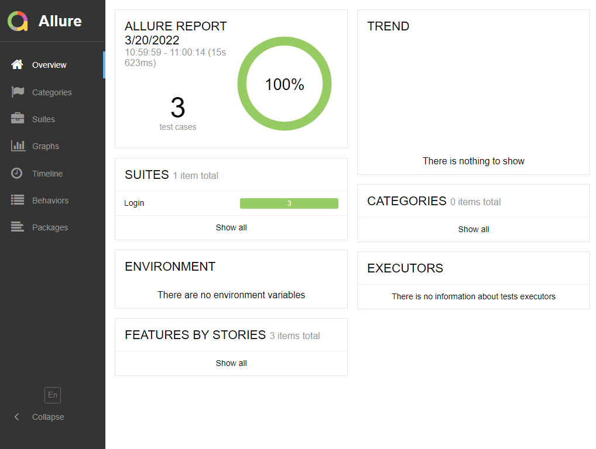

# Automation Challenge

## Objetivo

Criar um projeto de automação utilizando como base o site **Automation Practice**.
Efetue um cadastro de usuário.

É necessário conter no mínimo os seguintes cenários

* `Login com sucesso`
* `Login inválido`
* `Login em Branco`

### Como inicializar?

Primeiro, é necessario ter o Node instalado [Node](https://nodejs.org/en/)

Faça um clone do repositorio com o comando abaixo::
### `git clone https://github.com/Jefferson-W/ChallengeME-Cypress.git`

Para instalar as dependências use :
### `npm install`

Agora, basta digitar o comando abaixo, para rodar o Cypress e a Spec.
### `npm run test`

Para rodar o teste por "baixo dos panos" (fora do Browser), utilize o comando abaixo.
### `npm run cy:run`

Para gerar o Allure Reports, utilize os comandos na sequencia abaixo:

### `npm run allure:run `
### `npm run allure:report`
### `npm run allure:open `

- Será gerado no Browser, o HTML conforme evidencia:

 

    
    

### Tecnologias

- [Cypress](https://www.cypress.io/): Framework utilizado para rodar os testes;
- Javascript: linguagem utilizada junto com  o framework;
- Arquivo com massa de dados: Gerado o arquivo em cypress/factories/login.js contendo a massa de dados para os testes;
- [Page Objects](https://www.toolsqa.com/cypress/page-object-pattern-in-cypress/);
- Evidencias do teste: Gerado o arquivo em Cypress/videos/login.spec.js.mp4;
- [Faker](https://www.npmjs.com/package/faker/v/5.5.3): lib faker, para gerar dados ficticios auxiliando na criação da massa de dados;
- [Allure](https://www.npmjs.com/package/@shelex/cypress-allure-plugin): Uma biblioteca muito utilizada pelos frameworks de testes para elaboração dos resultados dos mesmos através de um relatório elegante e amigável.

